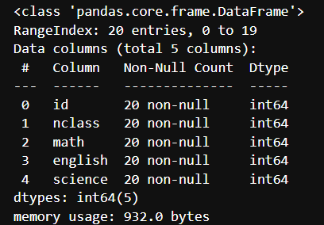
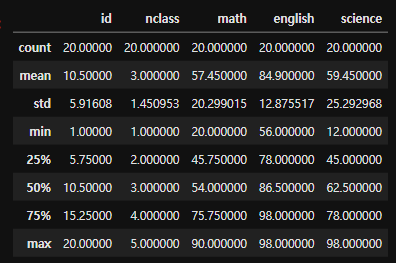

# 데이터 분석 기초
## 1. 데이터 파악하기
#### 데이터를 파악할 때 사용하는 명령어
|함수|기능|
|---|---|
|head()|앞부분 출력|
|tail()|뒷부분 출력|
|shape|행, 열 개수 출력|
|info()|변수 속성 출력|
|describe()|요약 통계량 출력|

- head() : 데이터의 앞에서부터 다섯번째 행까지 출력하는 기능
  - exam.head(10) > 앞에서부터 10행까지 출력가능
- tail() : 데이터의 뒤에서부터 다섯번째 행까지 출력
  - exam.tail(10) > 뒤에서부터 10행까지 출력가능
- shade : (어트리뷰트 이므로 괄호가 뒤에 붙지 않음) 데이터가 몇행, 몇열로 구성되는지 알아보기 위해 사용 > 데이터프레임의 크기를 알아볼 때 사용
- info() : 데이터에 들어있는 변수들의 속성을 한눈에 파악하고 싶을 때 사용
  -  
  -  첫번째 행 : exam이 pandas로 만든 데이터프레임이다.
  -  두번째 행 : exam은 20개의 행으로 되어있고, 행 번호가 0부터 19번째이다.
  -  세번째 행 : exam은 5개의 변수로 구성되어있다.
  -  그 아래는 변수의 인덱스번호(#), 변수명(Column), 변수 안에 들어있는 값의 개수(Non-Null Count- 결측치를 제외한 개수), 속성(Dtype)을 보여준다. 
- describe() : 요약통계량을 구하는 함수 
  - 
  - count : 개수
  - mean : 평균
  - std : 표준편차 (변수들의 값들이 평균에서 떨어진 정도를 나타낸 값)
  - min : 최소값
  - 25% : 1사분위수 (하위 25% 지점에 위치한 값)
  - 50% : 중앙값 (하위 50% 지점에 위치한 값)
  - 75% : 3사분위수 (하위 75% 지점에 위치한 값)
  - max : 최댓값
- describe(include='all') : 문자로 된 변수의 요약 통계량도 함께 출력
  - count : 값의 개수
  - unique : 중복값 제거한 범주의 개수
  - top : 최빈값
  - freq : 최빈값의 빈도
  

  ## 2. 함수와 메서드 차이 알아보기
  1. 내장함수 : 기본적으로 파이썬에 내정된 함수 (별도, 패키지를 설치하거나 불러오지 않아도 사용가능)
  2. 패키지함수 : 패키지를 로드해야 사용할 수 있으며 패키지명을 먼저 입력하고 .함수()를 사용
  3. 메서드 : 변수가 가지고 있는 함수. 변수명을 입력한 다음 .메서드()를 사용
  4. 어트리뷰트 : 변수가 가지고 있는 값. 변수명을 입력한 다음 .어트리뷰트를 사용 (괄호 사용 x)

  - 메서드와 어트리뷰트의 차이
    - 메서드 : 변수에 내장된 기능을 사용
    - 어트리뷰트 : 변수의 특징을 살펴볼 때 사용

## 3. 변수명 바꾸기

데이터의 전반적인 특징을 파악하고 나면 변수명을 자신이 이해하기 좋은 단어로 바꾸어야 구분하기 편하다.

- 변수명.copy() : 복사본 만들기
- 변수명.rename(columns={'원래 컬럼명' : '수정할 컬럼명'})
  - 딕셔너리 형태로 수정

## 4. 파생변수 만들기

데이터 내의 변수를 조합하거나 함수를 이용해서 새 변수를 만들어서 분석할 수도 있다.
- 파생변수 : 기존 변수를 변형해 만든 변수
  - 데이터 프레임 명에[]를 붙여 새로 만들 변수명을 입력하고 '='으로 새로운 변수의 값을 지정해준다.